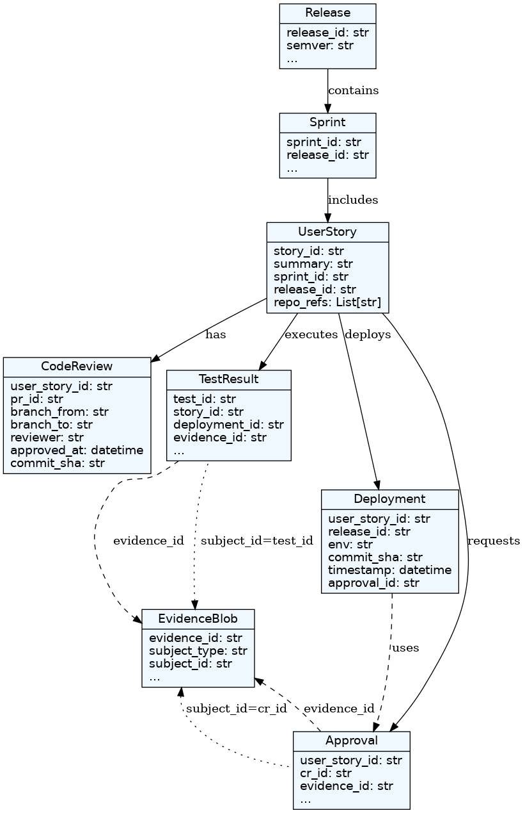

# Evidence Vault API Documentation

The Evidence Vault tracks SDLC activities for traceability and auditability of engineering practices.

## 📘 Evidence Vault – SDLC Traceability Example

This document illustrates the end-to-end software development lifecycle (SDLC) traceability for a canonical Jira story `PROJECT-5000`.

Each step includes metadata such as test IDs, test results, commit hashes, reviewers, ServiceNow CRs, and links to evidence blob IDs and file URLs.

## 🗂 API Endpoints

### 🧠 User Stories
- `POST /user-story` - Create a new user story (assigns sprint + release)
- `GET /user-story/{story_id}` - Get one story
- `GET /user-stories` - List all user stories
- `GET /sprint/{sprint_id}/user-stories` - List stories in a sprint
- `GET /release/{release_id}/user-stories` - List stories in a release

### 🔁 Code Reviews
- `POST /code-review` - Submit a code review
- `GET /code-review/{pr_id}` - Get review for a PR
- `GET /user-story/{story_id}/code-reviews` - Get reviews linked to a user story

### 🧪 Test Results
- `POST /test-result` - Upload test result (unit, integration, etc.)
- `GET /test-result/{test_id}` - Get one test result
- `GET /user-story/{story_id}/test-results` - Get test results for a story
- `GET /deployment/{deployment_id}/test-results` - Get tests linked to a deployment
- `GET /test-results?sprint_id=&env=` - Filter test results

### 🚀 Deployments
- `POST /deployment` - Record a deployment
- `GET /deployment/{release_id}/{env}` - Get deployments for a release/env
- `GET /user-story/{story_id}/deployments` - Get deployments involving this story
- `GET /commit/{sha}/deployments` - Trace where a commit was deployed

### 📝 Approvals (SNOW CRs)
- `POST /approval` - Save approval metadata
- `GET /approval/{cr_id}` - Get one approval
- `GET /approvals?release_id=&env=` - Filter approvals

### 📎 Evidence Blobs
- `POST /evidence` - Upload evidence
- `GET /evidence/{evidence_id}` - Get evidence details
- `GET /evidence?related_to=commit_sha|cr_id|story_id` - Query evidence by linkage

### 📦 Releases
- `POST /release` - Create new release with semantic version
- `GET /release/{release_id}` - View release metadata
- `GET /releases` - List all releases

### ⏱ Sprints
- `POST /sprint` - Create new sprint
- `GET /sprint/{sprint_id}` - Get sprint metadata
- `GET /sprints` - List all sprints
---

### 🧭 Composite Traceability Views
- `GET /traceability/story/{story_id}` - Full chain: PRs, tests, deploys, approvals
- `GET /traceability/commit/{sha}` - Track test/deploy/review for commit
- `GET /traceability/release/{release_id}` - Full release audit chain

---

## 🔁 SDLC Workflow Overview

The Evidence Vault captures artifacts at each stage of the software development lifecycle (SDLC) for traceability and audit purposes. Here’s how the domain model maps to the SDLC:

| **Stage** | **Artifact / Domain Model** | **Endpoint(s)** |
|-----------|-----------------------------|------------------|
| A Jira story is created and assigned to a sprint & release | `UserStory` | `POST /user-story` |
| Developer begins coding and creates a feature branch | (Captured in `branch_from` in `CodeReview`) | `POST /code-review` |
| Developer runs local unit & integration tests | `TestResult` | `POST /test-result` |
| PR is opened for dev → peer-reviewed and approved | `CodeReview` + `EvidenceBlob` | `POST /code-review`, `POST /evidence` |
| CI runs unit tests on merged code | `TestResult` | `POST /test-result` |
| Code is deployed to DEV environment | `Deployment` | `POST /deployment` |
| CI runs integration tests in DEV | `TestResult` | `POST /test-result` |
| PR is opened for dev → main | `CodeReview` | `POST /code-review` |
| CI runs PREQ tests post-merge | `TestResult` | `POST /test-result` |
| Code is deployed to PREQ | `Deployment` | `POST /deployment` |
| SNOW Change Request is created for QA | `Approval` | `POST /approval` |
| QA CR is approved | `Approval` + `EvidenceBlob` | `POST /approval`, `POST /evidence` |
| Code is deployed to QA | `Deployment` | `POST /deployment` |
| Integration tests run in QA | `TestResult` | `POST /test-result` |
| SNOW CR is created and approved for PROD | `Approval` + `EvidenceBlob` | `POST /approval`, `POST /evidence` |
| Code is deployed to PROD | `Deployment` | `POST /deployment` |
| Integration tests run in PROD | `TestResult` | `POST /test-result` |
| End-to-end traceability is audited | Composite of all above | `GET /traceability/story/{story_id}` |

---

## 🧱 Domain Model Schema

This section outlines the data models used in the Evidence Vault system.





### `UserStory`
```json
{
  "story_id": "PLAT-1378",
  "summary": "Add user login via OAuth2",
  "sprint_id": "SPRINT-2025-01",
  "release_id": "PLAT-v4.0.3",
  "repo_refs": ["git@example.com:myorg/my-repo.git"]
}
```

### `CodeReview`
```json
{
  "user_story_id": "PLAT-1378",
  "pr_id": "PR-101",
  "branch_from": "feature/PLAT-1378-oauth-login",
  "branch_to": "dev",
  "reviewer": "alice@example.com",
  "approved_at": "2025-01-12T15:32:00Z",
  "commit_sha": "abc123sha"
}
```

### `Deployment`
```json
{
  "user_story_id": "PLAT-1378",
  "release_id": "PLAT-v4.0.3",
  "env": "qa",
  "commit_sha": "abc123sha",
  "timestamp": "2025-01-13T09:45:00Z",
  "pipeline_version": "v4.0.3",
  "approval_id": "SNOW12345"
}
```

### `Approval`
```json
{
  "user_story_id": "PLAT-1378",
  "cr_id": "SNOW12345",
  "env": "qa",
  "status": "approved",
  "approved_by": "release.manager@example.com",
  "approved_at": "2025-01-13T10:15:00Z"
}
```

### `TestResult`
```json
{
  "test_id": "TEST-001",
  "story_id": "PLAT-1378",
  "deployment_id": "qa-2025-01-13T09-45-00",
  "env": "qa",
  "sprint_id": "SPRINT-2025-01",
  "type": "unit_test",
  "passed": 120,
  "failed": 0,
  "coverage_percent": 92.5,
  "submitted_by": "qa@example.com",
  "timestamp": "2025-01-13T10:00:00Z",
  "evidence_ids": ["EV-001", "EV-002"]
}
```

### `EvidenceBlob`
```json
{
  "evidence_id": "EV-001",
  "type": "test_report",
  "subject_type": "test_result",
  "subject_id": "TEST-001",
  "related_to": "PLAT-1378",
  "file_url": "s3://evidence-vault/PLAT-v4.0.3/SPRINT-2025-01/evidence/EV-001.test_report.json",
  "timestamp": "2025-01-13T09:46:00Z",
  "submitted_by": "jmatias@example.com",
  "metadata": {
    "test_id": "TST-123",
    "coverage_percent": 85.2,
    "passed": 154,
    "failed": 0
  }
}
```

### `Release`
```json
{
  "release_id": "PLAT-v4.0.3",
  "semver": "4.0.3",
  "business_application_id": "APP-1234",
  "jira_ticket": "https://jira.example.com/browse/PLAT-v4.0.3",
  "pipeline_version": "v7.0.3"
}
```

### `Sprint`
```json
{
  "sprint_id": "SPRINT-2025-01",
  "release_id": "PLAT-v4.0.3",
  "start_date": "2025-01-01",
  "end_date": "2025-01-14",
  "quality_designation": "Compliant"
}
```
