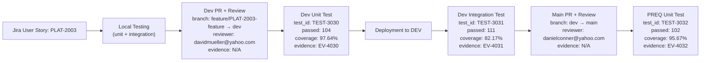
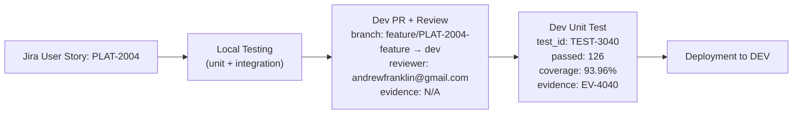
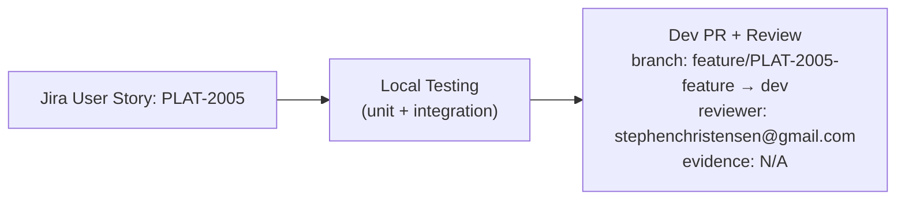

## PLAT-2000

```mermaid
graph LR
  US["Jira User Story: PLAT-2000"]
  TESTLOCAL["Local Testing<br>(unit + integration)"]
  US --> TESTLOCAL
  PRCRDEV["Dev PR + Review<br>branch: feature/PLAT-2000-feature → dev<br>reviewer: harrissherry@harrison-trujillo.com<br>evidence: N/A"]
  TESTLOCAL --> PRCRDEV
  TESTDEV1["Dev Unit Test<br>test_id: TEST-3000<br>passed: 106<br>coverage: 92.71%<br>evidence: EV-4000"]
  PRCRDEV --> TESTDEV1
  DEVDEPLOY["Deployment to DEV"]
  TESTDEV1 --> DEVDEPLOY
  TESTDEV2["Dev Integration Test<br>test_id: TEST-3001<br>passed: 101<br>coverage: 94.76%<br>evidence: EV-4001"]
  DEVDEPLOY --> TESTDEV2
  PRCRMAIN["Main PR + Review<br>branch: dev → main<br>reviewer: ortegatyler@gmail.com<br>evidence: N/A"]
  TESTDEV2 --> PRCRMAIN
  TESTPREQ["PREQ Unit Test<br>test_id: TEST-3002<br>passed: 99<br>coverage: 90.12%<br>evidence: EV-4002"]
  PRCRMAIN --> TESTPREQ
  PREQDEPLOY["Deployment to PREQ"]
  TESTPREQ --> PREQDEPLOY
  QADEPLOY["Deploy to QA (SNOWQA2000)<br>status: approved<br>manager: cynthiaanderson@hotmail.com<br>evidence: EV-4006"]
  PREQDEPLOY --> QADEPLOY
  TESTQA["QA Integration Test<br>test_id: TEST-3003<br>passed: 141<br>coverage: 97.29%<br>evidence: EV-4003"]
  QADEPLOY --> TESTQA
  PRODDEPLOY["Deploy to PROD (SNOWPROD2000)<br>status: approved<br>manager: cosborne@yahoo.com<br>evidence: EV-4007"]
  TESTQA --> PRODDEPLOY
  TESTPROD["PROD Integration Test<br>test_id: TEST-3004<br>passed: 138<br>coverage: 85.32%<br>evidence: EV-4004"]
  PRODDEPLOY --> TESTPROD
```

## PLAT-2001

```mermaid
graph LR
  US["Jira User Story: PLAT-2001"]
  TESTLOCAL["Local Testing<br>(unit + integration)"]
  US --> TESTLOCAL
  PRCRDEV["Dev PR + Review<br>branch: feature/PLAT-2001-feature → dev<br>reviewer: craiggarrison@fernandez.biz<br>evidence: N/A"]
  TESTLOCAL --> PRCRDEV
  TESTDEV1["Dev Unit Test<br>test_id: TEST-3010<br>passed: 131<br>coverage: 92.81%<br>evidence: EV-4010"]
  PRCRDEV --> TESTDEV1
  DEVDEPLOY["Deployment to DEV"]
  TESTDEV1 --> DEVDEPLOY
  TESTDEV2["Dev Integration Test<br>test_id: TEST-3011<br>passed: 91<br>coverage: 93.81%<br>evidence: EV-4011"]
  DEVDEPLOY --> TESTDEV2
  PRCRMAIN["Main PR + Review<br>branch: dev → main<br>reviewer: russell49@heath-castillo.biz<br>evidence: N/A"]
  TESTDEV2 --> PRCRMAIN
  TESTPREQ["PREQ Unit Test<br>test_id: TEST-3012<br>passed: 148<br>coverage: 94.76%<br>evidence: EV-4012"]
  PRCRMAIN --> TESTPREQ
  PREQDEPLOY["Deployment to PREQ"]
  TESTPREQ --> PREQDEPLOY
  QADEPLOY["Deploy to QA (SNOWQA2001)<br>status: approved<br>manager: scottbaker@gmail.com<br>evidence: EV-4016"]
  PREQDEPLOY --> QADEPLOY
  TESTQA["QA Integration Test<br>test_id: TEST-3013<br>passed: 92<br>coverage: 84.71%<br>evidence: EV-4013"]
  QADEPLOY --> TESTQA
  PRODDEPLOY["Deploy to PROD (SNOWPROD2001)<br>status: approved<br>manager: aherrera@martin.com<br>evidence: EV-4017"]
  TESTQA --> PRODDEPLOY
```

## PLAT-2002

```mermaid
graph LR
  US["Jira User Story: PLAT-2002"]
  TESTLOCAL["Local Testing<br>(unit + integration)"]
  US --> TESTLOCAL
  PRCRDEV["Dev PR + Review<br>branch: feature/PLAT-2002-feature → dev<br>reviewer: astark@yahoo.com<br>evidence: N/A"]
  TESTLOCAL --> PRCRDEV
  TESTDEV1["Dev Unit Test<br>test_id: TEST-3020<br>passed: 116<br>coverage: 87.48%<br>evidence: EV-4020"]
  PRCRDEV --> TESTDEV1
  DEVDEPLOY["Deployment to DEV"]
  TESTDEV1 --> DEVDEPLOY
  TESTDEV2["Dev Integration Test<br>test_id: TEST-3021<br>passed: 123<br>coverage: 93.6%<br>evidence: EV-4021"]
  DEVDEPLOY --> TESTDEV2
  PRCRMAIN["Main PR + Review<br>branch: dev → main<br>reviewer: ashley50@hotmail.com<br>evidence: N/A"]
  TESTDEV2 --> PRCRMAIN
  TESTPREQ["PREQ Unit Test<br>test_id: TEST-3022<br>passed: 91<br>coverage: 97.33%<br>evidence: EV-4022"]
  PRCRMAIN --> TESTPREQ
  PREQDEPLOY["Deployment to PREQ"]
  TESTPREQ --> PREQDEPLOY
  QADEPLOY["Deploy to QA (SNOWQA2002)<br>status: approved<br>manager: hawkinsrichard@yahoo.com<br>evidence: EV-4026"]
  PREQDEPLOY --> QADEPLOY
```

## PLAT-2003

```mermaid
graph LR
  US["Jira User Story: PLAT-2003"]
  TESTLOCAL["Local Testing<br>(unit + integration)"]
  US --> TESTLOCAL
  PRCRDEV["Dev PR + Review<br>branch: feature/PLAT-2003-feature → dev<br>reviewer: davidmueller@yahoo.com<br>evidence: N/A"]
  TESTLOCAL --> PRCRDEV
  TESTDEV1["Dev Unit Test<br>test_id: TEST-3030<br>passed: 104<br>coverage: 97.64%<br>evidence: EV-4030"]
  PRCRDEV --> TESTDEV1
  DEVDEPLOY["Deployment to DEV"]
  TESTDEV1 --> DEVDEPLOY
  TESTDEV2["Dev Integration Test<br>test_id: TEST-3031<br>passed: 111<br>coverage: 82.17%<br>evidence: EV-4031"]
  DEVDEPLOY --> TESTDEV2
  PRCRMAIN["Main PR + Review<br>branch: dev → main<br>reviewer: danielconner@yahoo.com<br>evidence: N/A"]
  TESTDEV2 --> PRCRMAIN
  TESTPREQ["PREQ Unit Test<br>test_id: TEST-3032<br>passed: 102<br>coverage: 95.67%<br>evidence: EV-4032"]
  PRCRMAIN --> TESTPREQ
```

## PLAT-2004

```mermaid
graph LR
  US["Jira User Story: PLAT-2004"]
  TESTLOCAL["Local Testing<br>(unit + integration)"]
  US --> TESTLOCAL
  PRCRDEV["Dev PR + Review<br>branch: feature/PLAT-2004-feature → dev<br>reviewer: andrewfranklin@gmail.com<br>evidence: N/A"]
  TESTLOCAL --> PRCRDEV
  TESTDEV1["Dev Unit Test<br>test_id: TEST-3040<br>passed: 126<br>coverage: 93.96%<br>evidence: EV-4040"]
  PRCRDEV --> TESTDEV1
  DEVDEPLOY["Deployment to DEV"]
  TESTDEV1 --> DEVDEPLOY
```

## PLAT-2005

```mermaid
graph LR
  US["Jira User Story: PLAT-2005"]
  TESTLOCAL["Local Testing<br>(unit + integration)"]
  US --> TESTLOCAL
  PRCRDEV["Dev PR + Review<br>branch: feature/PLAT-2005-feature → dev<br>reviewer: stephenchristensen@gmail.com<br>evidence: N/A"]
  TESTLOCAL --> PRCRDEV
```

## PLAT-2006

```mermaid
graph LR
  US["Jira User Story: PLAT-2006"]
  TESTLOCAL["Local Testing<br>(unit + integration)"]
  US --> TESTLOCAL
  PRCRDEV["Dev PR + Review<br>branch: feature/PLAT-2006-feature → dev<br>reviewer: qlopez@hotmail.com<br>evidence: N/A"]
  TESTLOCAL --> PRCRDEV
  TESTDEV1["Dev Unit Test<br>test_id: TEST-3060<br>passed: 146<br>coverage: 93.89%<br>evidence: EV-4060"]
  PRCRDEV --> TESTDEV1
  DEVDEPLOY["Deployment to DEV"]
  TESTDEV1 --> DEVDEPLOY
  TESTDEV2["Dev Integration Test<br>test_id: TEST-3061<br>passed: 91<br>coverage: 86.83%<br>evidence: EV-4061"]
  DEVDEPLOY --> TESTDEV2
  PRCRMAIN["Main PR + Review<br>branch: dev → main<br>reviewer: dustinwilliams@hotmail.com<br>evidence: N/A"]
  TESTDEV2 --> PRCRMAIN
  TESTPREQ["PREQ Unit Test<br>test_id: TEST-3062<br>passed: 107<br>coverage: 89.51%<br>evidence: EV-4062"]
  PRCRMAIN --> TESTPREQ
  PREQDEPLOY["Deployment to PREQ"]
  TESTPREQ --> PREQDEPLOY
  QADEPLOY["Deploy to QA (SNOWQA2006)<br>status: approved<br>manager: matthew22@owen.org<br>evidence: EV-4066"]
  PREQDEPLOY --> QADEPLOY
  TESTQA["QA Integration Test<br>test_id: TEST-3063<br>passed: 113<br>coverage: 90.68%<br>evidence: EV-4063"]
  QADEPLOY --> TESTQA
  PRODDEPLOY["Deploy to PROD (SNOWPROD2006)<br>status: approved<br>manager: johnwright@hotmail.com<br>evidence: EV-4067"]
  TESTQA --> PRODDEPLOY
  TESTPROD["PROD Integration Test<br>test_id: TEST-3064<br>passed: 138<br>coverage: 95.35%<br>evidence: EV-4064"]
  PRODDEPLOY --> TESTPROD
```
